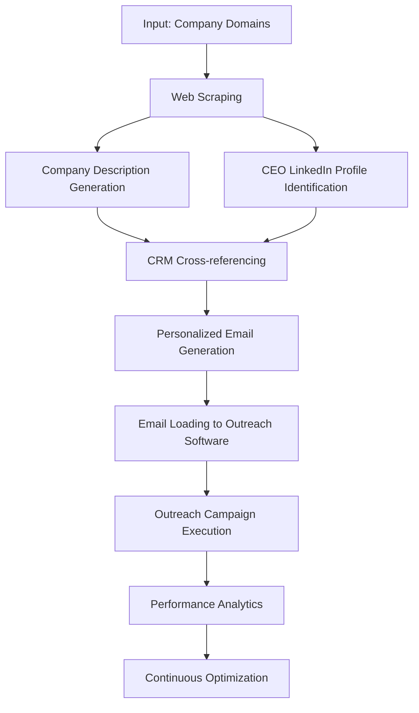
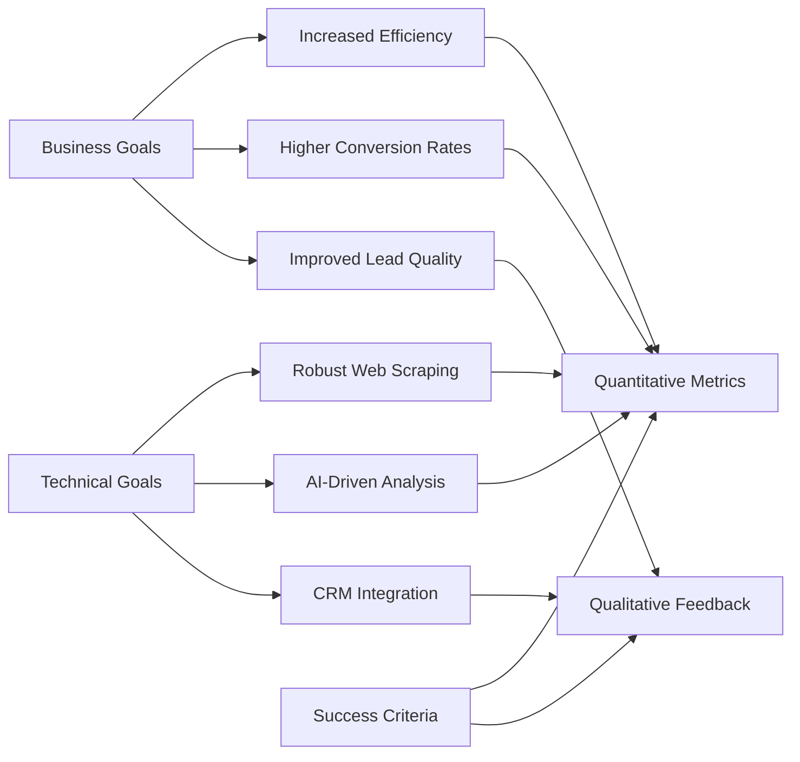
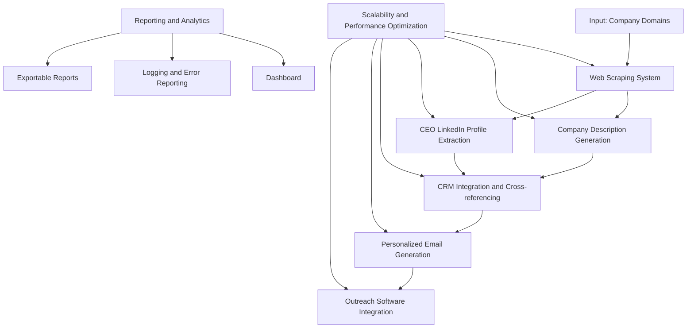
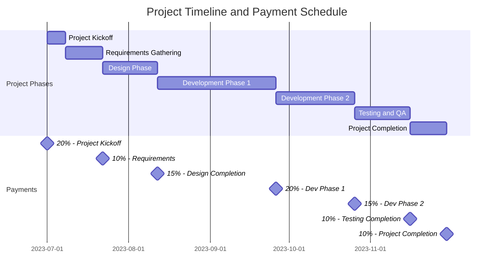
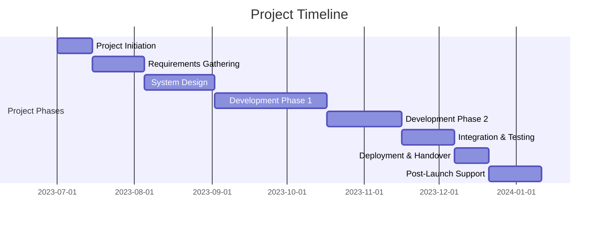
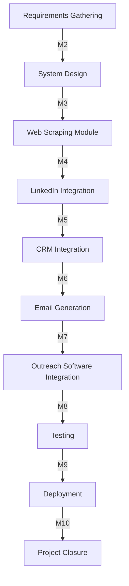
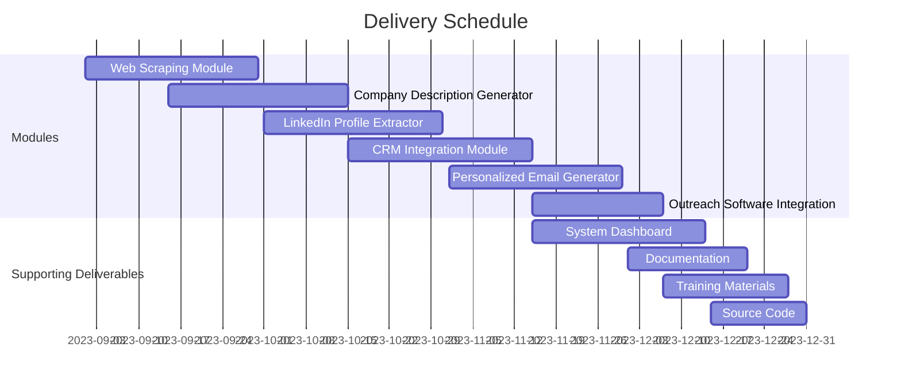

## EXECUTIVE SUMMARY

### PROJECT OVERVIEW

This project aims to develop an automated B2B lead generation and outreach solution for our client. The system will streamline the process of identifying potential business partners, gathering relevant information, and initiating personalized contact. By leveraging web scraping, data analysis, and automated email generation, the solution will significantly enhance the efficiency and effectiveness of the client's outreach efforts.

The proposed system will:
1. Accept a list of company domains as input
2. Scrape relevant subpages for company information
3. Generate concise company descriptions
4. Locate CEO LinkedIn profiles and contact information
5. Cross-reference with internal CRM data
6. Craft personalized outreach emails
7. Load emails into the client's outreach software

### OBJECTIVES

1. Automate the lead generation process, reducing manual effort by 80%
2. Increase the quality and relevance of leads by leveraging AI-driven data analysis
3. Improve outreach effectiveness through personalized email content
4. Streamline the integration with existing CRM and outreach systems
5. Reduce the time-to-contact for new leads by 60%
6. Increase the overall conversion rate of outreach efforts by 30%

### VALUE PROPOSITION

Our agency offers a unique combination of expertise and technology to deliver an unparalleled lead generation and outreach solution:

1. **Cutting-edge AI and ML capabilities**: Our proprietary algorithms ensure accurate company analysis and highly personalized outreach content.

2. **Scalable architecture**: The solution is designed to handle varying workloads, from small batches to large-scale campaigns.

3. **Seamless integration**: Our system will work harmoniously with the client's existing CRM and outreach software, minimizing disruption to current workflows.

4. **Data privacy and compliance**: We prioritize data security and ensure all processes adhere to relevant regulations (e.g., GDPR, CCPA).

5. **Continuous improvement**: Our solution includes analytics and feedback loops to constantly refine and optimize the outreach process.

6. **Expert support**: Our team of experienced data scientists and software engineers will provide ongoing support and updates to maximize the system's effectiveness.

## PROJECT OBJECTIVES

### BUSINESS GOALS

1. Increase lead generation efficiency by 80% through automation
2. Boost conversion rates from outreach efforts by 30%
3. Reduce time-to-contact for new leads by 60%
4. Improve the quality and relevance of generated leads
5. Enhance the personalization of outreach communications
6. Streamline the overall B2B sales process
7. Increase ROI on outreach campaigns

### TECHNICAL GOALS

1. Develop a robust web scraping system capable of extracting relevant information from various company websites
2. Implement AI-driven algorithms for generating accurate and concise company descriptions
3. Create an efficient system for identifying and extracting CEO LinkedIn profiles and contact information
4. Develop a seamless integration with the client's existing CRM system for cross-referencing and data enrichment
5. Implement natural language processing (NLP) capabilities for crafting personalized outreach emails
6. Design and implement an API for smooth integration with the client's outreach software
7. Ensure scalability to handle varying workloads, from small batches to large-scale campaigns
8. Implement robust error handling and logging mechanisms for system reliability and troubleshooting

### SUCCESS CRITERIA

| Metric | Target |
|--------|--------|
| Reduction in manual lead generation effort | 80% |
| Increase in outreach campaign conversion rate | 30% |
| Decrease in time-to-contact for new leads | 60% |
| Accuracy of generated company descriptions | ≥ 95% |
| Accuracy of CEO contact information | ≥ 98% |
| System uptime | 99.9% |
| API response time | < 500ms |
| User satisfaction score | ≥ 4.5/5 |

## SCOPE OF WORK

### IN-SCOPE

1. Web Scraping System
   - Develop a robust web scraper capable of extracting information from company websites
   - Implement intelligent parsing of relevant subpages (e.g., "/about-us", "/team", "/leadership")
   - Handle various website structures and content formats

2. Company Description Generation
   - Implement AI-driven algorithms to analyze scraped data
   - Generate concise and accurate company descriptions
   - Ensure consistency in description format and length

3. CEO LinkedIn Profile and Contact Information Extraction
   - Develop a system to locate and extract CEO LinkedIn profiles
   - Implement methods to gather CEO contact information
   - Ensure compliance with LinkedIn's terms of service and data privacy regulations

4. CRM Integration and Cross-referencing
   - Design and implement an integration with the client's existing CRM system
   - Develop functionality to cross-reference new leads with existing CRM data
   - Implement data enrichment processes for existing CRM entries

5. Personalized Email Generation
   - Develop NLP algorithms for crafting personalized outreach emails
   - Implement templates and dynamic content insertion
   - Ensure email content adheres to best practices and compliance standards

6. Outreach Software Integration
   - Design and implement an API for seamless integration with the client's outreach software
   - Develop functionality to load generated emails into the outreach system
   - Implement error handling and retry mechanisms for failed loads

7. Scalability and Performance Optimization
   - Design the system architecture to handle varying workloads
   - Implement caching mechanisms and database optimizations
   - Ensure efficient resource utilization and minimal processing times

8. Reporting and Analytics
   - Develop a dashboard for monitoring system performance and campaign effectiveness
   - Implement logging and error reporting mechanisms
   - Create exportable reports for key metrics and insights

### OUT-OF-SCOPE

1. Manual data entry or lead research
2. Creation or management of outreach campaigns within the client's outreach software
3. Direct integration with social media platforms other than LinkedIn
4. Development of a user interface for manual data input or system control
5. Automatic updating of the client's CRM system with new lead information
6. Real-time monitoring of email open rates or response tracking
7. Automatic follow-up email generation or scheduling
8. Integration with marketing automation platforms beyond the specified outreach software

### ASSUMPTIONS

1. The client will provide a list of company domains as input for the system
2. The client's existing CRM system has an accessible API for integration
3. The client's outreach software supports API-based email loading
4. The client has necessary permissions and complies with regulations for email outreach
5. The client will provide access to any required internal data sources
6. The project team will have access to necessary development and testing environments
7. The client will provide timely feedback and approvals during the development process

### DEPENDENCIES

| Dependency | Description | Impact |
|------------|-------------|--------|
| LinkedIn API | Access to LinkedIn's API for profile data extraction | Critical for CEO information gathering |
| Web Scraping Libraries | Availability and functionality of chosen web scraping libraries | Essential for data collection process |
| NLP Models | Access to suitable NLP models for text generation | Crucial for personalized email creation |
| Cloud Infrastructure | Availability of chosen cloud services for system deployment | Necessary for system scalability and performance |
| Client's CRM System | Stability and API accessibility of the client's CRM | Required for data cross-referencing and enrichment |
| Client's Outreach Software | API functionality and stability of the outreach software | Essential for email loading and campaign integration |
| Data Privacy Regulations | Compliance with GDPR, CCPA, and other relevant regulations | Critical for legal operation of the system |

## BUDGET AND COST ESTIMATES

### COST BREAKDOWN

The following table provides a detailed breakdown of the project costs:

| Category | Item | Cost (USD) |
|----------|------|------------|
| Labor | Senior Software Engineer (800 hours @ $150/hr) | 120,000 |
| Labor | Data Scientist (400 hours @ $140/hr) | 56,000 |
| Labor | DevOps Engineer (200 hours @ $130/hr) | 26,000 |
| Labor | Project Manager (300 hours @ $120/hr) | 36,000 |
| Labor | QA Engineer (300 hours @ $100/hr) | 30,000 |
| Software | Web Scraping Libraries (Annual License) | 5,000 |
| Software | NLP Model API (Annual Subscription) | 12,000 |
| Software | Cloud Infrastructure (Estimated Annual Cost) | 24,000 |
| Software | Monitoring and Analytics Tools | 6,000 |
| Miscellaneous | Legal and Compliance Consultation | 10,000 |
| Miscellaneous | Contingency (10% of total) | 32,500 |
| **Total** |  | **357,500** |

### PAYMENT SCHEDULE

The proposed payment schedule is tied to project milestones and deliverables:

| Milestone | Deliverable | Payment (% of Total) | Amount (USD) |
|-----------|-------------|----------------------|--------------|
| Project Kickoff | Signed contract and project plan | 20% | 71,500 |
| Requirements Gathering | Approved requirements document | 10% | 35,750 |
| Design Phase Completion | Approved system architecture and design documents | 15% | 53,625 |
| Development Phase 1 | Working prototype of web scraping and data analysis modules | 20% | 71,500 |
| Development Phase 2 | Integration with CRM and outreach software completed | 15% | 53,625 |
| Testing and QA | Successful completion of all test cases | 10% | 35,750 |
| Project Completion | System deployment and handover | 10% | 35,750 |

### BUDGET CONSIDERATIONS

1. **Scalability Costs**: The cloud infrastructure costs may vary based on the actual usage and scaling requirements of the system. We have provided an estimate, but this could fluctuate based on the volume of data processed and the frequency of system usage.

   *Mitigation*: We will implement cost monitoring and alerting systems to track cloud usage and expenses. We'll also design the system with cost-optimization in mind, using auto-scaling and serverless technologies where appropriate.

2. **API and Third-Party Service Costs**: The costs for NLP Model API and Web Scraping Libraries are based on current pricing models. These could change if usage exceeds expected levels or if the service providers modify their pricing structures.

   *Mitigation*: We will closely monitor API usage and explore options for bulk pricing or committed use discounts. We'll also evaluate alternative providers to ensure we're getting the best value.

3. **Regulatory Compliance**: Changes in data privacy regulations or additional compliance requirements could necessitate system modifications or additional legal consultations.

   *Mitigation*: We've included a budget for legal and compliance consultation. We'll stay informed about upcoming regulatory changes and factor them into our development process.

4. **Scope Creep**: As the project progresses, there may be requests for additional features or modifications to the original scope.

   *Mitigation*: We've included a 10% contingency in the budget. Any significant scope changes will be evaluated for their impact on the budget and timeline, and will require formal approval before implementation.

5. **Integration Challenges**: Unforeseen complexities in integrating with the client's CRM or outreach software could require additional development time.

   *Mitigation*: We'll conduct thorough discovery sessions early in the project to understand the client's systems. We've also allocated ample time for integration work in our project timeline.

6. **Data Quality and Quantity**: The effectiveness of the AI models and the system's performance may vary based on the quality and quantity of input data.

   *Mitigation*: We'll work closely with the client to understand their data sources and implement data validation processes. If necessary, we may need to allocate additional resources for data cleaning or augmentation.

By proactively addressing these considerations and maintaining open communication with the client, we aim to manage the budget effectively and deliver the project within the estimated costs.

## TIMELINE AND MILESTONES

### PROJECT TIMELINE

The project is estimated to take approximately 6 months from initiation to completion. Below is a high-level timeline outlining the major phases of the project:

### KEY MILESTONES

The following table outlines the critical milestones that mark significant progress points in the project:

| Milestone | Description | Target Date |
|-----------|-------------|-------------|
| M1: Project Kickoff | Project charter signed, team assembled | 2023-07-01 |
| M2: Requirements Approval | Detailed requirements document approved by stakeholders | 2023-08-04 |
| M3: Design Completion | System architecture and detailed design documents approved | 2023-09-01 |
| M4: Web Scraping Module | Completion of web scraping and company description generation modules | 2023-09-30 |
| M5: LinkedIn Integration | CEO LinkedIn profile and contact information extraction module completed | 2023-10-15 |
| M6: CRM Integration | Integration with client's CRM system for cross-referencing completed | 2023-10-31 |
| M7: Email Generation | Personalized email generation module completed | 2023-11-15 |
| M8: Outreach Software Integration | Integration with client's outreach software completed | 2023-11-30 |
| M9: Testing Completion | All testing phases completed, including integration and user acceptance testing | 2023-12-06 |
| M10: System Deployment | System deployed to production environment | 2023-12-20 |
| M11: Project Closure | Project handover completed, documentation finalized | 2023-12-31 |

### CRITICAL PATH

The following tasks and activities are critical to keeping the project on schedule:

1. **Requirements Gathering and Approval**: Delays in finalizing requirements could impact all subsequent phases.

2. **System Design**: A robust and scalable design is crucial for the success of the project.

3. **Web Scraping Module Development**: This is the foundation of the system and needs to be completed before other modules can be fully developed.

4. **LinkedIn Integration**: Critical for obtaining CEO information, any delays could impact the personalization of outreach emails.

5. **CRM and Outreach Software Integration**: These integrations are essential for the system's functionality within the client's existing workflow.

6. **Testing and Bug Fixing**: Adequate time must be allocated for thorough testing and resolving any issues discovered.

7. **Data Privacy and Compliance**: Ensuring the system complies with all relevant regulations is critical and must be considered throughout the development process.

To maintain the project schedule, close monitoring of these critical path items is essential. Regular status updates, risk assessments, and proactive problem-solving will be implemented to address any potential delays or issues that may arise during the project lifecycle.

## DELIVERABLES

### LIST OF DELIVERABLES

1. **Web Scraping Module**
   - Custom web scraper for extracting company information
   - Data cleaning and preprocessing scripts
   - Documentation on usage and maintenance

2. **Company Description Generator**
   - AI-driven text generation model
   - API for generating company descriptions
   - Documentation on model training and usage

3. **LinkedIn Profile Extractor**
   - CEO LinkedIn profile identification algorithm
   - Contact information extraction tool
   - Usage guidelines and compliance documentation

4. **CRM Integration Module**
   - API for interfacing with client's CRM system
   - Data cross-referencing and enrichment scripts
   - Integration setup guide and troubleshooting documentation

5. **Personalized Email Generator**
   - NLP-based email content generation model
   - Email template management system
   - User guide for customizing email templates

6. **Outreach Software Integration**
   - API for loading emails into client's outreach software
   - Error handling and retry mechanism
   - Integration documentation and best practices

7. **System Dashboard**
   - Web-based dashboard for monitoring system performance
   - Reporting and analytics tools
   - User manual for dashboard operation

8. **Documentation**
   - System architecture document
   - API documentation
   - User manuals for each module
   - Installation and deployment guide
   - Maintenance and troubleshooting guide

9. **Training Materials**
   - Video tutorials for system usage
   - Interactive training modules for each component
   - Quick reference guides

10. **Source Code**
    - Full source code repository
    - Code documentation and comments
    - Build and deployment scripts

### DELIVERY SCHEDULE

| Deliverable | Expected Delivery Date |
|-------------|------------------------|
| Web Scraping Module | 2023-09-30 |
| Company Description Generator | 2023-10-15 |
| LinkedIn Profile Extractor | 2023-10-31 |
| CRM Integration Module | 2023-11-15 |
| Personalized Email Generator | 2023-11-30 |
| Outreach Software Integration | 2023-12-07 |
| System Dashboard | 2023-12-14 |
| Documentation | 2023-12-21 |
| Training Materials | 2023-12-28 |
| Source Code | 2023-12-31 |

### ACCEPTANCE CRITERIA

1. **Web Scraping Module**
   - Successfully scrapes 95% of target websites without errors
   - Extracts relevant information from at least 3 different page types (e.g., About Us, Team, Leadership)
   - Processes a minimum of 100 domains per hour

2. **Company Description Generator**
   - Generates coherent and accurate descriptions for 90% of input companies
   - Descriptions are between 50-100 words in length
   - API responds within 2 seconds for single company requests

3. **LinkedIn Profile Extractor**
   - Correctly identifies CEO LinkedIn profiles for 85% of input companies
   - Extracts valid contact information for 80% of identified profiles
   - Complies with LinkedIn's terms of service and data privacy regulations

4. **CRM Integration Module**
   - Successfully integrates with client's CRM system with 99.9% uptime
   - Cross-references new leads with existing CRM data with 100% accuracy
   - Enriches existing CRM entries with new data for 95% of matches

5. **Personalized Email Generator**
   - Generates unique, contextually relevant emails for 95% of input data
   - Emails pass spam filter tests with a 99% success rate
   - Allows for customization of email templates and variables

6. **Outreach Software Integration**
   - Successfully loads 99% of generated emails into the outreach software
   - Handles errors and implements retry mechanism for failed loads
   - Integrates with the outreach software's API with 99.9% reliability

7. **System Dashboard**
   - Displays real-time system performance metrics with less than 5-second lag
   - Generates accurate reports for all key metrics
   - Allows for customization of dashboard views and export of data

8. **Documentation**
   - Covers all system components and features comprehensively
   - Includes clear, step-by-step instructions for installation and usage
   - Passes review by technical writing team and client representatives

9. **Training Materials**
   - Covers all major system functions and use cases
   - Achieves a minimum of 90% comprehension rate in user testing
   - Compatible with client's Learning Management System (if applicable)

10. **Source Code**
    - Passes all unit and integration tests with 100% success rate
    - Adheres to agreed-upon coding standards and best practices
    - Successfully builds and deploys in client's development environment

Each deliverable will be subject to a formal review and approval process by the client. Acceptance will be confirmed in writing after the client has had sufficient time to test and validate each component against these criteria.