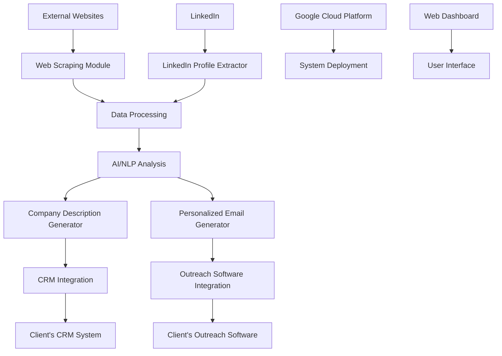
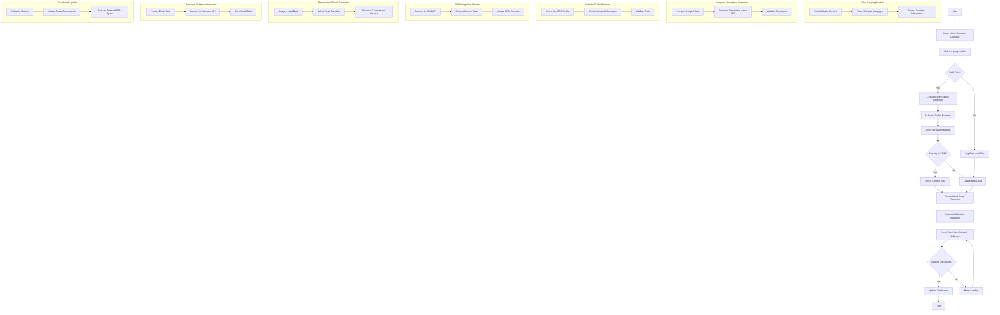
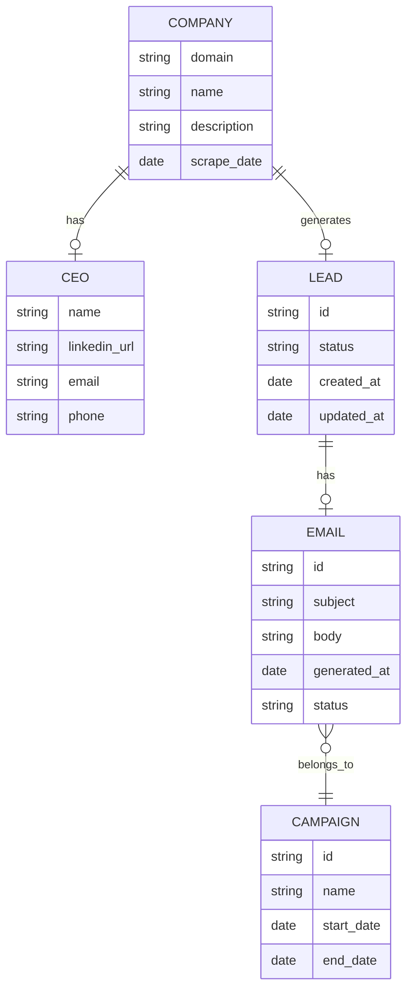
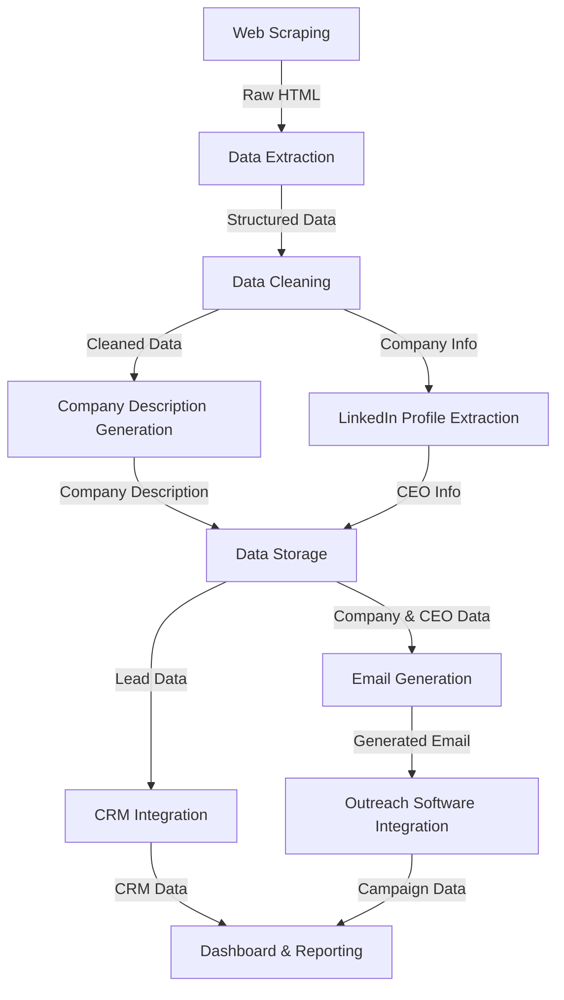

# 1. INTRODUCTION

## 1.1 PURPOSE

The purpose of this Software Requirements Specification (SRS) document is to provide a comprehensive and detailed description of the automated B2B lead generation and outreach solution. This document serves as the primary reference for the development team, project stakeholders, and quality assurance personnel. It outlines the functional and non-functional requirements, system architecture, and design constraints for the software product.

The intended audience for this SRS includes:

1. Development Team: Software engineers, data scientists, and DevOps specialists responsible for implementing the system.
2. Project Managers: To guide project planning, resource allocation, and timeline management.
3. Quality Assurance Team: For developing test plans and ensuring the system meets specified requirements.
4. Client Representatives: To review and approve the proposed solution and its alignment with business objectives.
5. Maintenance and Support Teams: For understanding the system architecture and functionality for future maintenance and upgrades.

This document will evolve throughout the development process, with revisions and updates made as necessary to reflect changes in requirements or project scope.

## 1.2 SCOPE

The automated B2B lead generation and outreach solution is a comprehensive system designed to streamline and enhance the process of identifying potential business partners, gathering relevant information, and initiating personalized contact. This software product aims to significantly improve the efficiency and effectiveness of B2B outreach efforts by leveraging advanced technologies such as web scraping, artificial intelligence, and automated email generation.

### Goals

1. Automate the lead generation process, reducing manual effort by 80%.
2. Increase the quality and relevance of generated leads.
3. Improve outreach effectiveness through personalized communication.
4. Streamline integration with existing CRM and outreach systems.
5. Reduce time-to-contact for new leads by 60%.
6. Increase overall conversion rates of outreach efforts by 30%.

### Benefits

1. Significant time and resource savings in lead generation and outreach processes.
2. Higher quality leads resulting in improved conversion rates.
3. Enhanced personalization leading to better engagement with potential clients.
4. Improved data accuracy and enrichment of existing CRM records.
5. Scalability to handle varying workloads, from small batches to large-scale campaigns.
6. Comprehensive analytics for continuous optimization of outreach strategies.

### Core Functionalities

1. **Web Scraping System**: A robust web scraper built with Python, capable of extracting relevant information from company websites and handling various website structures.

2. **Company Description Generation**: An AI-driven system using natural language processing models to generate concise and accurate company descriptions based on scraped data.

3. **CEO LinkedIn Profile and Contact Information Extraction**: A module for locating and extracting CEO LinkedIn profiles and contact information, ensuring compliance with LinkedIn's terms of service.

4. **CRM Integration and Cross-referencing**: A Python-based backend system that integrates with the client's existing CRM, cross-references new leads, and enriches existing data.

5. **Personalized Email Generation**: An NLP-powered system for crafting personalized outreach emails, incorporating templates and dynamic content insertion.

6. **Outreach Software Integration**: An API-based integration with the client's outreach software, built with Python, for seamless loading of generated emails.

7. **System Dashboard**: A web-based dashboard developed using React and Tailwind CSS, providing real-time monitoring of system performance and campaign effectiveness.

8. **Cloud Infrastructure**: Utilization of Google Cloud Platform for scalable and reliable system deployment, including services such as Google Kubernetes Engine for containerization and Cloud Storage for data management.

This solution will provide a comprehensive, end-to-end system for B2B lead generation and outreach, significantly enhancing the client's ability to identify and engage with potential business partners efficiently and effectively.

## 2. PRODUCT DESCRIPTION

### 2.1 PRODUCT PERSPECTIVE

The automated B2B lead generation and outreach solution is designed to integrate seamlessly with the client's existing business processes and technological ecosystem. It serves as a comprehensive system that bridges the gap between various data sources, analysis tools, and outreach platforms. The product operates within the following context:

1. **Data Acquisition**: The system interfaces with external websites and LinkedIn to gather company and executive information.

2. **Data Processing**: It leverages AI and NLP technologies to process and analyze the acquired data.

3. **CRM Integration**: The solution integrates with the client's existing CRM system for data cross-referencing and enrichment.

4. **Outreach Software Integration**: It connects with the client's current outreach software for email delivery.

5. **Cloud Infrastructure**: The system is deployed on Google Cloud Platform, utilizing various GCP services for scalability and reliability.

6. **User Interface**: A web-based dashboard provides users with system controls and performance metrics.



### 2.2 PRODUCT FUNCTIONS

The automated B2B lead generation and outreach solution performs the following main functions:

1. **Web Scraping**: Extracts relevant information from company websites based on provided domain names.

2. **Company Description Generation**: Utilizes AI to create concise and accurate company descriptions from scraped data.

3. **CEO LinkedIn Profile Extraction**: Identifies and extracts CEO LinkedIn profiles and contact information.

4. **CRM Cross-referencing**: Integrates with the client's CRM to cross-reference and enrich existing data.

5. **Personalized Email Generation**: Creates tailored outreach emails using NLP and template customization.

6. **Outreach Software Integration**: Loads generated emails into the client's outreach software for campaign execution.

7. **Performance Monitoring**: Provides real-time analytics and reporting on system performance and campaign effectiveness.

8. **Data Management**: Handles data storage, retrieval, and processing across various system components.

### 2.3 USER CHARACTERISTICS

The system is designed for use by the following user personas:

1. **Sales Representatives**
   - Expertise: Intermediate to advanced in sales processes, basic technical skills
   - Primary use: Initiating and managing outreach campaigns, reviewing generated leads and emails

2. **Marketing Managers**
   - Expertise: Advanced in marketing strategies, intermediate technical skills
   - Primary use: Analyzing campaign performance, adjusting outreach strategies, customizing email templates

3. **Data Analysts**
   - Expertise: Advanced in data analysis, intermediate to advanced technical skills
   - Primary use: Interpreting system analytics, optimizing lead generation processes, data quality assurance

4. **IT Administrators**
   - Expertise: Advanced technical skills, system administration experience
   - Primary use: System maintenance, integration management, troubleshooting

5. **C-level Executives**
   - Expertise: High-level business acumen, basic to intermediate technical skills
   - Primary use: Reviewing high-level performance metrics, strategic decision-making based on system insights

### 2.4 CONSTRAINTS

1. **Technical Constraints**
   - Must integrate with the client's existing CRM and outreach software
   - System performance must support processing of at least 1000 company domains per day
   - API rate limits for LinkedIn and other third-party services

2. **Regulatory Constraints**
   - Compliance with GDPR, CCPA, and other relevant data protection regulations
   - Adherence to LinkedIn's terms of service for data scraping and usage

3. **Operational Constraints**
   - System downtime for maintenance limited to off-peak hours
   - 24/7 availability required with 99.9% uptime SLA

4. **Security Constraints**
   - All data transmissions must be encrypted using industry-standard protocols
   - Multi-factor authentication required for system access
   - Regular security audits and penetration testing

5. **Budgetary Constraints**
   - Development and deployment costs must remain within the approved budget of $357,500
   - Ongoing operational costs should not exceed 15% of the initial development cost annually

6. **Time Constraints**
   - The system must be fully operational within 6 months from project initiation

### 2.5 ASSUMPTIONS AND DEPENDENCIES

**Assumptions**:

1. The client will provide timely access to their CRM and outreach software APIs for integration purposes.
2. The volume of company domains to be processed will not exceed 5000 per day.
3. The client has the necessary legal rights and permissions to collect and use the data processed by the system.
4. Users of the system will have basic computer literacy and familiarity with CRM and outreach processes.
5. The client's existing infrastructure can support the additional load introduced by the new system.

**Dependencies**:

1. **External APIs**:
   - LinkedIn API for profile data extraction
   - Client's CRM API for data integration
   - Client's outreach software API for email loading

2. **Third-party Services**:
   - Natural Language Processing models for text generation and analysis
   - Web scraping libraries and services

3. **Cloud Services**:
   - Google Cloud Platform services (e.g., Google Kubernetes Engine, Cloud Storage, Cloud Functions)

4. **Data Sources**:
   - Availability and accuracy of company websites for scraping
   - Consistency of LinkedIn profile structures for data extraction

5. **Regulatory Compliance**:
   - Ongoing compliance with evolving data protection regulations

6. **Client Resources**:
   - Availability of client's IT team for integration support and troubleshooting
   - Client's commitment to providing necessary data and feedback during development and testing phases

7. **Internet Connectivity**:
   - Reliable high-speed internet connection for cloud services and API communications

8. **Browser Compatibility**:
   - Support for modern web browsers (Chrome, Firefox, Safari, Edge) for the web-based dashboard

By addressing these assumptions and dependencies proactively, we can mitigate risks and ensure the successful development and deployment of the automated B2B lead generation and outreach solution.

Here's the PROCESS FLOWCHART section for the SRS using Mermaid JS, consistent with the previously mentioned technologies and choices:

## PROCESS FLOWCHART

The following flowchart illustrates the end-to-end process of the automated B2B lead generation and outreach solution:



This flowchart provides a comprehensive overview of the system's process flow, from input of company domains to the final step of updating the dashboard. It includes the main steps and decision points, as well as subgraphs detailing the internal processes of key modules.

Key components and technologies highlighted in the flowchart:

1. Web Scraping Module: Implemented in Python for efficient data extraction.
2. Company Description Generator: Utilizes NLP techniques, likely implemented in Python.
3. LinkedIn Profile Extractor: Python-based module for finding and extracting CEO information.
4. CRM Integration Module: Python backend for interfacing with the client's CRM system.
5. Personalized Email Generator: NLP-powered system using Python for content generation.
6. Outreach Software Integration: Python-based API integration for loading emails.
7. Dashboard Update: React components for the frontend, styled with Tailwind CSS.

This flowchart maintains consistency with the previously mentioned technologies and architectural choices, emphasizing the use of Python for backend processes and React with Tailwind CSS for the user interface components.

Here's a breakdown of the product features with the requested sub-sections, maintaining consistency with previous choices and technologies mentioned in the document:

## 3. FUNCTIONAL REQUIREMENTS

### 3.1 Web Scraping Module

#### ID
F001

#### DESCRIPTION
A robust web scraping system that extracts relevant information from company websites based on provided domain names.

#### PRIORITY
High

#### TABLE OF FUNCTIONAL REQUIREMENTS

| ID | Requirement | Description |
|----|-------------|-------------|
| F001.1 | Domain Input | Accept a list of company domain names as input |
| F001.2 | Subpage Navigation | Intelligently navigate to relevant subpages (e.g., "/about-us", "/team") |
| F001.3 | Content Extraction | Extract key information such as company description, team members, and contact details |
| F001.4 | Error Handling | Implement robust error handling for various website structures and connection issues |
| F001.5 | Data Cleaning | Clean and preprocess extracted data for further analysis |
| F001.6 | Rate Limiting | Implement rate limiting to avoid overloading target websites |
| F001.7 | Proxy Support | Support the use of proxy servers to avoid IP blocking |

### 3.2 Company Description Generator

#### ID
F002

#### DESCRIPTION
An AI-driven system that generates concise and accurate company descriptions based on scraped data.

#### PRIORITY
High

#### TABLE OF FUNCTIONAL REQUIREMENTS

| ID | Requirement | Description |
|----|-------------|-------------|
| F002.1 | Data Analysis | Analyze scraped data to identify key company information |
| F002.2 | NLP Processing | Use Natural Language Processing to generate coherent descriptions |
| F002.3 | Length Control | Ensure generated descriptions are between 50-100 words |
| F002.4 | Tone Consistency | Maintain a consistent, professional tone across all descriptions |
| F002.5 | Keyword Inclusion | Include relevant industry keywords in the generated descriptions |
| F002.6 | Multilingual Support | Support description generation in multiple languages |
| F002.7 | API Endpoint | Provide an API endpoint for description generation requests |

### 3.3 LinkedIn Profile Extractor

#### ID
F003

#### DESCRIPTION
A module for locating and extracting CEO LinkedIn profiles and contact information, ensuring compliance with LinkedIn's terms of service.

#### PRIORITY
Medium

#### TABLE OF FUNCTIONAL REQUIREMENTS

| ID | Requirement | Description |
|----|-------------|-------------|
| F003.1 | Profile Search | Implement algorithm to search for CEO profiles based on company information |
| F003.2 | Data Extraction | Extract relevant information from identified LinkedIn profiles |
| F003.3 | Contact Info Retrieval | Gather available contact information for the CEO |
| F003.4 | Compliance Checks | Ensure all operations comply with LinkedIn's terms of service |
| F003.5 | Rate Limiting | Implement rate limiting for LinkedIn API requests |
| F003.6 | Data Validation | Validate extracted data for accuracy and completeness |
| F003.7 | Error Handling | Handle cases where CEO profiles cannot be found or accessed |

### 3.4 CRM Integration and Cross-referencing

#### ID
F004

#### DESCRIPTION
A Python-based backend system that integrates with the client's existing CRM, cross-references new leads, and enriches existing data.

#### PRIORITY
High

#### TABLE OF FUNCTIONAL REQUIREMENTS

| ID | Requirement | Description |
|----|-------------|-------------|
| F004.1 | CRM API Integration | Develop integration with client's CRM API |
| F004.2 | Data Cross-referencing | Cross-reference new leads with existing CRM data |
| F004.3 | Data Enrichment | Update existing CRM entries with newly acquired information |
| F004.4 | Duplicate Detection | Identify and handle potential duplicate entries |
| F004.5 | Data Sync | Implement bi-directional data synchronization between the system and CRM |
| F004.6 | Error Logging | Log all errors and inconsistencies during the integration process |
| F004.7 | Audit Trail | Maintain an audit trail of all changes made to CRM data |

### 3.5 Personalized Email Generation

#### ID
F005

#### DESCRIPTION
An NLP-powered system for crafting personalized outreach emails, incorporating templates and dynamic content insertion.

#### PRIORITY
High

#### TABLE OF FUNCTIONAL REQUIREMENTS

| ID | Requirement | Description |
|----|-------------|-------------|
| F005.1 | Template Management | Allow creation and management of email templates |
| F005.2 | Dynamic Content | Insert dynamic content based on company and CEO information |
| F005.3 | Tone Analysis | Analyze and adjust email tone for appropriateness |
| F005.4 | Personalization | Generate highly personalized email content for each lead |
| F005.5 | A/B Testing | Support A/B testing of different email variations |
| F005.6 | Spam Check | Implement spam score checking for generated emails |
| F005.7 | Multilingual Support | Generate emails in multiple languages based on recipient preferences |

### 3.6 Outreach Software Integration

#### ID
F006

#### DESCRIPTION
An API-based integration with the client's outreach software, built with Python, for seamless loading of generated emails.

#### PRIORITY
Medium

#### TABLE OF FUNCTIONAL REQUIREMENTS

| ID | Requirement | Description |
|----|-------------|-------------|
| F006.1 | API Integration | Develop integration with client's outreach software API |
| F006.2 | Email Loading | Load generated emails into the outreach software |
| F006.3 | Campaign Assignment | Assign loaded emails to appropriate outreach campaigns |
| F006.4 | Error Handling | Implement error handling and retry mechanisms for failed loads |
| F006.5 | Batch Processing | Support batch processing of multiple emails |
| F006.6 | Status Tracking | Track and report the status of email loads |
| F006.7 | Rate Limiting | Implement rate limiting to comply with outreach software API restrictions |

### 3.7 System Dashboard

#### ID
F007

#### DESCRIPTION
A web-based dashboard developed using React and Tailwind CSS, providing real-time monitoring of system performance and campaign effectiveness.

#### PRIORITY
Medium

#### TABLE OF FUNCTIONAL REQUIREMENTS

| ID | Requirement | Description |
|----|-------------|-------------|
| F007.1 | Performance Metrics | Display key performance metrics in real-time |
| F007.2 | Campaign Analytics | Show analytics for ongoing and past outreach campaigns |
| F007.3 | User Authentication | Implement secure user authentication and authorization |
| F007.4 | Customizable Views | Allow users to customize dashboard views and widgets |
| F007.5 | Data Visualization | Create interactive charts and graphs for data visualization |
| F007.6 | Alerting System | Implement an alerting system for critical performance issues |
| F007.7 | Export Functionality | Allow exporting of dashboard data and reports |

### 3.8 Cloud Infrastructure

#### ID
F008

#### DESCRIPTION
Utilization of Google Cloud Platform for scalable and reliable system deployment, including services such as Google Kubernetes Engine for containerization and Cloud Storage for data management.

#### PRIORITY
High

#### TABLE OF FUNCTIONAL REQUIREMENTS

| ID | Requirement | Description |
|----|-------------|-------------|
| F008.1 | Containerization | Deploy application components using Google Kubernetes Engine |
| F008.2 | Data Storage | Utilize Google Cloud Storage for efficient data management |
| F008.3 | Scalability | Implement auto-scaling for handling varying workloads |
| F008.4 | Monitoring | Set up monitoring using Google Cloud Monitoring |
| F008.5 | Logging | Implement centralized logging using Google Cloud Logging |
| F008.6 | Security | Ensure all GCP services adhere to security best practices |
| F008.7 | Disaster Recovery | Implement disaster recovery and backup solutions |

This breakdown of features maintains consistency with the previously mentioned technologies and architectural choices, emphasizing the use of Python for backend processes, React with Tailwind CSS for the user interface components, and Google Cloud Platform for infrastructure and deployment.

## 4. NON-FUNCTIONAL REQUIREMENTS

### 4.1 PERFORMANCE

| ID | Requirement | Description |
|----|-------------|-------------|
| NFR-P1 | Web Scraping Speed | The system shall scrape and process a minimum of 100 company websites per hour. |
| NFR-P2 | API Response Time | All API endpoints shall respond within 500ms for 95% of requests under normal load. |
| NFR-P3 | Email Generation Time | Personalized emails shall be generated within 2 seconds per email. |
| NFR-P4 | Dashboard Loading Time | The React-based dashboard shall load within 3 seconds on initial page load. |
| NFR-P5 | CRM Integration Sync | CRM data synchronization shall complete within 5 minutes for up to 10,000 records. |
| NFR-P6 | Resource Utilization | The system shall utilize no more than 80% of allocated CPU and memory resources during peak loads. |
| NFR-P7 | Concurrent Users | The system shall support at least 100 concurrent users without degradation in performance. |

### 4.2 SAFETY

| ID | Requirement | Description |
|----|-------------|-------------|
| NFR-S1 | Data Backup | The system shall perform daily backups of all critical data, stored in Google Cloud Storage with redundancy. |
| NFR-S2 | Failover Mechanism | Implement automatic failover to a secondary system within 5 minutes of primary system failure. |
| NFR-S3 | Data Recovery | The system shall be capable of full data recovery within 2 hours in case of catastrophic failure. |
| NFR-S4 | Error Handling | Implement comprehensive error handling to prevent system crashes and data corruption. |
| NFR-S5 | Input Validation | All user inputs shall be validated to prevent injection attacks and data inconsistencies. |
| NFR-S6 | Audit Logging | Maintain detailed audit logs of all system activities, especially those involving sensitive data operations. |

### 4.3 SECURITY

| ID | Requirement | Description |
|----|-------------|-------------|
| NFR-SEC1 | Authentication | Implement multi-factor authentication for all user accounts using industry-standard protocols. |
| NFR-SEC2 | Authorization | Enforce role-based access control (RBAC) for all system functions and data access. |
| NFR-SEC3 | Data Encryption | All data at rest shall be encrypted using AES-256 encryption, and data in transit shall use TLS 1.3. |
| NFR-SEC4 | API Security | Implement OAuth 2.0 for API authentication and rate limiting to prevent abuse. |
| NFR-SEC5 | Vulnerability Scanning | Conduct monthly automated vulnerability scans and address all high and critical findings within 7 days. |
| NFR-SEC6 | Penetration Testing | Perform annual penetration testing by a third-party security firm. |
| NFR-SEC7 | Privacy Controls | Implement data anonymization and pseudonymization techniques for PII in non-production environments. |

### 4.4 QUALITY

#### 4.4.1 Availability

| ID | Requirement | Description |
|----|-------------|-------------|
| NFR-Q1 | System Uptime | The system shall maintain 99.9% uptime, excluding scheduled maintenance windows. |
| NFR-Q2 | Scheduled Maintenance | Scheduled maintenance shall not exceed 4 hours per month and must be performed during off-peak hours. |

#### 4.4.2 Maintainability

| ID | Requirement | Description |
|----|-------------|-------------|
| NFR-Q3 | Code Quality | Maintain a minimum of 80% code coverage for unit tests. |
| NFR-Q4 | Documentation | Provide comprehensive API documentation using tools like Swagger for backend services. |
| NFR-Q5 | Version Control | Use Git for version control with a well-defined branching strategy and code review process. |

#### 4.4.3 Usability

| ID | Requirement | Description |
|----|-------------|-------------|
| NFR-Q6 | UI Responsiveness | The React-based UI shall be responsive and compatible with the latest versions of Chrome, Firefox, Safari, and Edge. |
| NFR-Q7 | Accessibility | The UI shall comply with WCAG 2.1 Level AA standards for accessibility. |
| NFR-Q8 | Internationalization | Support multiple languages, starting with English, Spanish, and French. |

#### 4.4.4 Scalability

| ID | Requirement | Description |
|----|-------------|-------------|
| NFR-Q9 | Horizontal Scaling | The system shall be capable of horizontal scaling to handle a 200% increase in load within 10 minutes. |
| NFR-Q10 | Database Scalability | Implement database sharding to support growth beyond 10 million records without performance degradation. |

#### 4.4.5 Reliability

| ID | Requirement | Description |
|----|-------------|-------------|
| NFR-Q11 | Error Rate | The system shall have an error rate of less than 0.1% for all transactions. |
| NFR-Q12 | Data Integrity | Implement transaction management to ensure data consistency across all operations. |
| NFR-Q13 | Monitoring | Utilize Google Cloud Monitoring for real-time system health and performance monitoring. |

### 4.5 COMPLIANCE

| ID | Requirement | Description |
|----|-------------|-------------|
| NFR-C1 | GDPR Compliance | Ensure full compliance with GDPR regulations, including data subject rights and consent management. |
| NFR-C2 | CCPA Compliance | Implement necessary controls to comply with the California Consumer Privacy Act. |
| NFR-C3 | Data Retention | Implement data retention policies in accordance with legal requirements and industry standards. |
| NFR-C4 | Audit Trail | Maintain a comprehensive audit trail of all data access and modifications for a minimum of 2 years. |
| NFR-C5 | Industry Standards | Adhere to ISO 27001 standards for information security management. |
| NFR-C6 | API Standards | Follow RESTful API design principles and OpenAPI Specification 3.0 for API documentation. |
| NFR-C7 | Accessibility Compliance | Ensure compliance with Section 508 of the Rehabilitation Act for all user interfaces. |

These non-functional requirements are designed to ensure the system's performance, safety, security, quality, and compliance with relevant standards and regulations. They are consistent with the previously mentioned technologies, including the use of React and Tailwind CSS for the user interface, Python for backend services, and Google Cloud Platform for infrastructure and services.

## 5. DATA REQUIREMENTS

### 5.1 DATA MODELS

The system will utilize the following data models to represent and manage information throughout the lead generation and outreach process:



#### TypeScript Interfaces

```typescript
interface Company {
  domain: string;
  name: string;
  description: string;
  scrapeDate: Date;
}

interface CEO {
  name: string;
  linkedinUrl: string;
  email: string;
  phone: string;
}

interface Lead {
  id: string;
  status: 'new' | 'contacted' | 'qualified' | 'converted' | 'lost';
  createdAt: Date;
  updatedAt: Date;
  company: Company;
  ceo: CEO;
}

interface Email {
  id: string;
  subject: string;
  body: string;
  generatedAt: Date;
  status: 'draft' | 'sent' | 'opened' | 'replied';
  lead: Lead;
}

interface Campaign {
  id: string;
  name: string;
  startDate: Date;
  endDate: Date;
  emails: Email[];
}
```

### 5.2 DATA STORAGE

The system will utilize Google Cloud Platform (GCP) services for data storage, ensuring scalability, reliability, and security.

#### Primary Data Storage

- **Google Cloud Firestore**: A NoSQL document database will be used for storing structured data such as Company, CEO, Lead, Email, and Campaign information.

#### Blob Storage

- **Google Cloud Storage**: Used for storing large objects such as scraped web pages, generated reports, and email attachments.

#### Data Retention

- Company and CEO data: Retained indefinitely, with periodic updates
- Lead data: Retained for 5 years after the last interaction
- Email data: Retained for 3 years
- Campaign data: Retained for 5 years after campaign completion

#### Redundancy and Backup

- Firestore data will be automatically replicated across multiple regions for high availability.
- Daily backups of Firestore data will be stored in Google Cloud Storage with versioning enabled.
- Cloud Storage data will use the "Multi-Regional" storage class for high durability and availability.

#### Recovery

- Automated point-in-time recovery will be configured for Firestore, allowing data restoration to any point within the last 30 days.
- A disaster recovery plan will be implemented, including regular testing of data restoration procedures.

### 5.3 DATA PROCESSING

The system will process data through various stages, ensuring security and efficiency throughout the pipeline.

#### Data Flow



#### Data Security

1. **Encryption**:
   - All data at rest will be encrypted using Google Cloud's default encryption.
   - Sensitive data fields (e.g., email addresses, phone numbers) will use additional application-level encryption.

2. **Access Control**:
   - Identity and Access Management (IAM) will be used to control access to GCP resources.
   - Application-level role-based access control (RBAC) will be implemented for user access to data.

3. **Data in Transit**:
   - All API communications will use HTTPS with TLS 1.3.
   - VPC Service Controls will be implemented to restrict data access to approved IP ranges.

4. **Audit Logging**:
   - Cloud Audit Logs will be enabled to track all data access and modifications.
   - Application-level logging will record user actions and data changes.

5. **Data Masking**:
   - Personal Identifiable Information (PII) will be masked in non-production environments.

6. **Compliance**:
   - Data processing will adhere to GDPR and CCPA requirements.
   - Data Subject Access Requests (DSAR) functionality will be implemented to allow for data retrieval and deletion.

#### Data Processing Steps

1. **Web Scraping**:
   - Python-based scraper using libraries like BeautifulSoup or Scrapy.
   - Rate limiting and user-agent rotation to respect website policies.

2. **Data Extraction and Cleaning**:
   - Python scripts for parsing HTML and extracting relevant information.
   - Data validation and cleaning using pandas and custom algorithms.

3. **Company Description Generation**:
   - Natural Language Processing (NLP) model using libraries like spaCy or NLTK.
   - Integration with Google Cloud Natural Language API for enhanced text analysis.

4. **LinkedIn Profile Extraction**:
   - Custom Python module for LinkedIn data extraction, respecting LinkedIn's terms of service.
   - Integration with third-party APIs for additional data enrichment.

5. **CRM Integration**:
   - Python backend using Flask or FastAPI for API development.
   - Asynchronous processing using Celery for handling large data volumes.

6. **Email Generation**:
   - Template-based system with dynamic content insertion.
   - Integration with Google Cloud Translation API for multi-language support.

7. **Outreach Software Integration**:
   - RESTful API integration using Python requests library.
   - Queueing system using Redis for managing API call rates.

8. **Dashboard & Reporting**:
   - React-based frontend with Tailwind CSS for styling.
   - Data visualization using libraries like Chart.js or D3.js.
   - Real-time updates using WebSocket connections.

By implementing these data requirements, the system will ensure efficient, secure, and scalable handling of lead generation and outreach data throughout its lifecycle.

## 6. EXTERNAL INTERFACES

### 6.1 USER INTERFACES

The automated B2B lead generation and outreach solution will feature a web-based user interface built using React and styled with Tailwind CSS. The interface will be responsive, supporting desktop and tablet devices, and will adhere to modern web accessibility standards (WCAG 2.1 AA).

Key components of the user interface include:

1. Dashboard
   - Overview of system performance metrics
   - Visualizations of lead generation and outreach statistics
   - Quick access to recent activities and pending tasks

2. Lead Management
   - List view of generated leads with filtering and sorting options
   - Detailed view of individual lead information
   - Ability to manually edit or enrich lead data

3. Campaign Management
   - Interface for creating and managing outreach campaigns
   - Email template editor with dynamic content insertion
   - Campaign performance analytics

4. System Configuration
   - Settings for web scraping parameters
   - Integration configuration for CRM and outreach software
   - User management and access control

5. Reporting
   - Custom report builder
   - Scheduled report generation and export options

Placeholder for mockups:

```
[Dashboard Mockup]
[Lead Management Interface Mockup]
[Campaign Management Interface Mockup]
[System Configuration Interface Mockup]
[Reporting Interface Mockup]
```

The user interface will be designed with a focus on usability and efficiency, featuring intuitive navigation, clear data visualization, and streamlined workflows for common tasks.

### 6.2 SOFTWARE INTERFACES

The system will interact with several external software components through well-defined APIs and integration points:

1. Client's CRM System
   - Protocol: RESTful API
   - Data Format: JSON
   - Authentication: OAuth 2.0
   - Key Functions:
     - Retrieve existing lead data
     - Create new lead entries
     - Update lead information
     - Cross-reference and deduplicate leads

2. Client's Outreach Software
   - Protocol: RESTful API
   - Data Format: JSON
   - Authentication: API Key
   - Key Functions:
     - Load generated emails into campaigns
     - Retrieve campaign performance metrics
     - Update email templates
     - Manage contact lists

3. LinkedIn API
   - Protocol: RESTful API
   - Data Format: JSON
   - Authentication: OAuth 2.0
   - Key Functions:
     - Search for company profiles
     - Retrieve CEO and executive information
     - Extract contact details (within terms of service limitations)

4. Google Cloud Natural Language API
   - Protocol: gRPC
   - Data Format: Protocol Buffers
   - Authentication: Service Account
   - Key Functions:
     - Analyze scraped text for entity recognition
     - Perform sentiment analysis on company descriptions
     - Generate summaries for company profiles

5. Google Cloud Storage
   - Protocol: XML API and JSON API
   - Data Format: Binary (for file storage), JSON (for metadata)
   - Authentication: Service Account
   - Key Functions:
     - Store scraped web pages and documents
     - Retrieve stored data for processing
     - Manage backups and archives

6. Google Cloud Pub/Sub
   - Protocol: gRPC
   - Data Format: Protocol Buffers
   - Authentication: Service Account
   - Key Functions:
     - Manage asynchronous communication between system components
     - Handle event-driven processing of scraped data and generated content

### 6.3 COMMUNICATION INTERFACES

The system will utilize various communication protocols and interfaces to ensure efficient data transfer and integration:

1. HTTP/HTTPS
   - Used for all web-based communications, including API calls and web scraping
   - TLS 1.3 encryption required for all data in transit
   - Certificate management through Google-managed SSL certificates

2. WebSocket
   - Used for real-time updates in the user interface
   - Secure WebSocket (WSS) protocol with TLS encryption

3. gRPC
   - Used for high-performance, low-latency communication between internal system components
   - Protobuf serialization for efficient data transfer

4. SMTP
   - Used for sending system notifications and alerts to administrators
   - TLS encryption required for all email communications

5. OAuth 2.0
   - Used for secure authentication with external APIs (CRM, LinkedIn)
   - Implements refresh token rotation for enhanced security

6. JSON Web Tokens (JWT)
   - Used for stateless authentication in the system's internal API

7. Virtual Private Cloud (VPC)
   - Utilized for secure, isolated network communication between system components within Google Cloud Platform

8. Cloud NAT (Network Address Translation)
   - Employed for outbound internet access from private GCP resources, ensuring consistent IP addressing for web scraping activities

Data Formats:

1. JSON: Primary data format for API requests and responses
2. Protocol Buffers: Used with gRPC for efficient serialization
3. CSV: Supported for bulk data imports and exports
4. XML: Supported for integration with legacy systems if required

All communication interfaces will be designed with security, scalability, and performance in mind, leveraging Google Cloud Platform's networking capabilities to ensure reliable and efficient data transfer throughout the system.

## APPENDICES

### A. GLOSSARY

| Term | Definition |
|------|------------|
| Web Scraping | The automated process of extracting data from websites using software tools or scripts. |
| Natural Language Processing (NLP) | A branch of artificial intelligence that deals with the interaction between computers and humans using natural language. |
| Lead Generation | The process of identifying and cultivating potential customers for a business's products or services. |
| Outreach | The act of contacting potential customers or clients to generate interest in a product or service. |
| API (Application Programming Interface) | A set of protocols, routines, and tools for building software applications that specify how software components should interact. |
| CRM (Customer Relationship Management) | A technology for managing all your company's relationships and interactions with customers and potential customers. |
| React | A JavaScript library for building user interfaces, particularly single-page applications. |
| Tailwind CSS | A utility-first CSS framework for rapidly building custom user interfaces. |
| TypeScript | A typed superset of JavaScript that compiles to plain JavaScript. |
| Google Cloud Platform (GCP) | A suite of cloud computing services provided by Google. |

### B. ACRONYMS

| Acronym | Expanded Form |
|---------|---------------|
| SRS | Software Requirements Specification |
| B2B | Business-to-Business |
| AI | Artificial Intelligence |
| ML | Machine Learning |
| UI | User Interface |
| API | Application Programming Interface |
| CRM | Customer Relationship Management |
| NLP | Natural Language Processing |
| GCP | Google Cloud Platform |
| CEO | Chief Executive Officer |
| GDPR | General Data Protection Regulation |
| CCPA | California Consumer Privacy Act |
| ROI | Return on Investment |
| SLA | Service Level Agreement |
| JWT | JSON Web Token |
| RBAC | Role-Based Access Control |
| VPC | Virtual Private Cloud |
| NAT | Network Address Translation |
| SMTP | Simple Mail Transfer Protocol |
| TLS | Transport Layer Security |
| WCAG | Web Content Accessibility Guidelines |

### C. ADDITIONAL REFERENCES

1. Google Cloud Documentation
   - https://cloud.google.com/docs

2. React Official Documentation
   - https://reactjs.org/docs/getting-started.html

3. Tailwind CSS Documentation
   - https://tailwindcss.com/docs

4. Python Official Documentation
   - https://docs.python.org/3/

5. TypeScript Handbook
   - https://www.typescriptlang.org/docs/handbook/intro.html

6. GDPR Official Text
   - https://gdpr-info.eu/

7. CCPA Official Resource
   - https://oag.ca.gov/privacy/ccpa

8. Web Content Accessibility Guidelines (WCAG) 2.1
   - https://www.w3.org/TR/WCAG21/

9. OAuth 2.0 Specification
   - https://oauth.net/2/

10. LinkedIn API Documentation
    - https://developer.linkedin.com/docs

11. Beautiful Soup Documentation (for web scraping)
    - https://www.crummy.com/software/BeautifulSoup/bs4/doc/

12. Natural Language Toolkit (NLTK) Documentation
    - https://www.nltk.org/

13. Google Cloud Natural Language API Documentation
    - https://cloud.google.com/natural-language/docs

14. Docker Documentation (for containerization)
    - https://docs.docker.com/

15. Kubernetes Documentation (for container orchestration)
    - https://kubernetes.io/docs/home/

These additional references provide comprehensive information on the technologies, frameworks, and regulations relevant to the development and deployment of the automated B2B lead generation and outreach solution. They serve as valuable resources for the development team, project managers, and stakeholders throughout the project lifecycle.