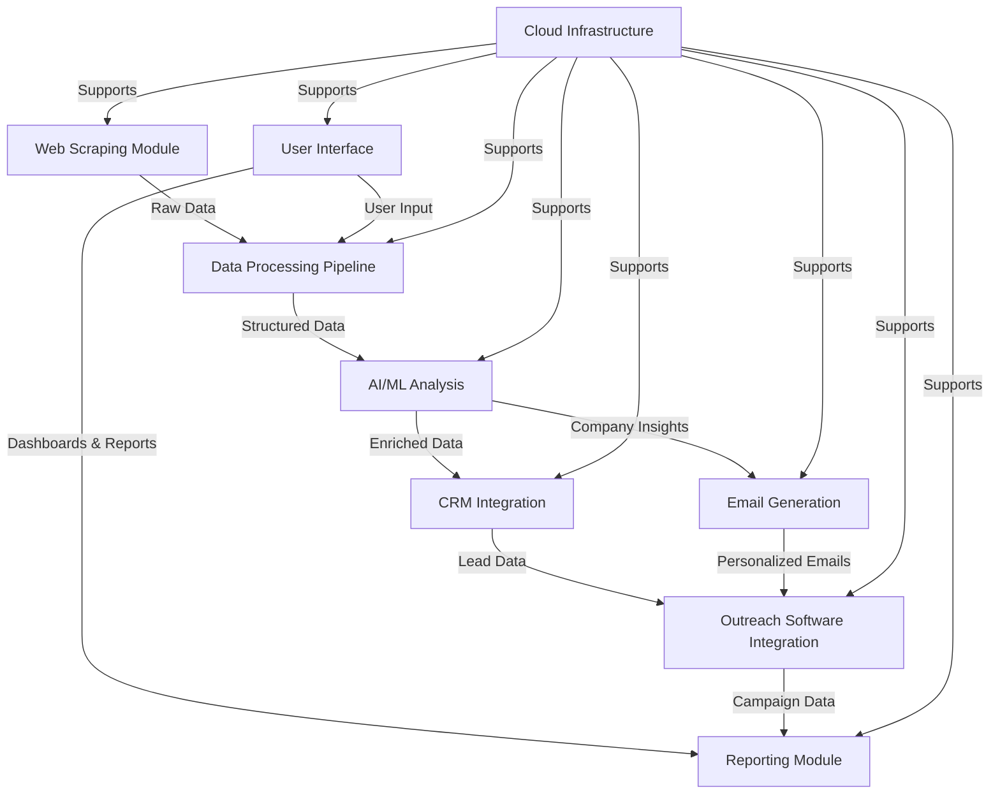
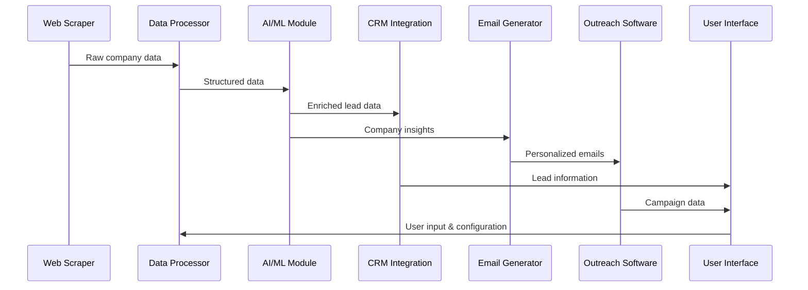
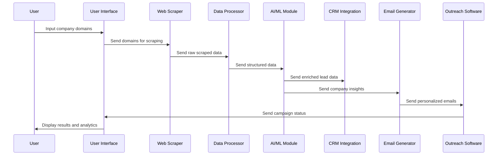
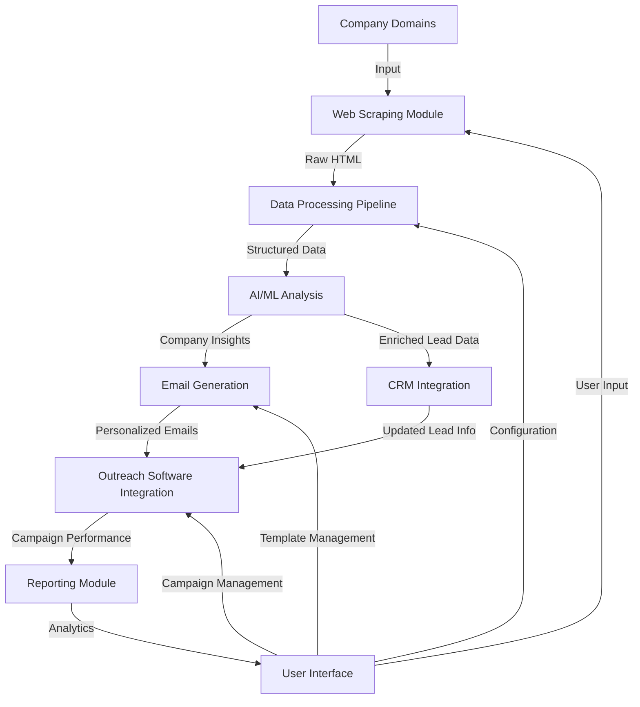
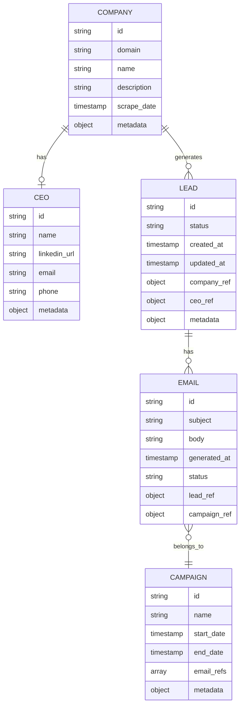
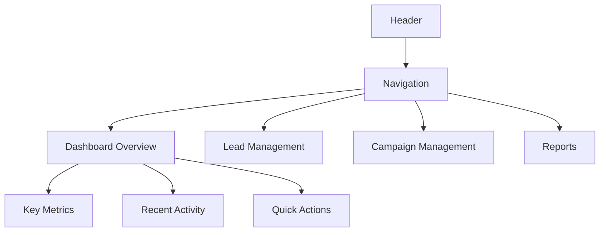
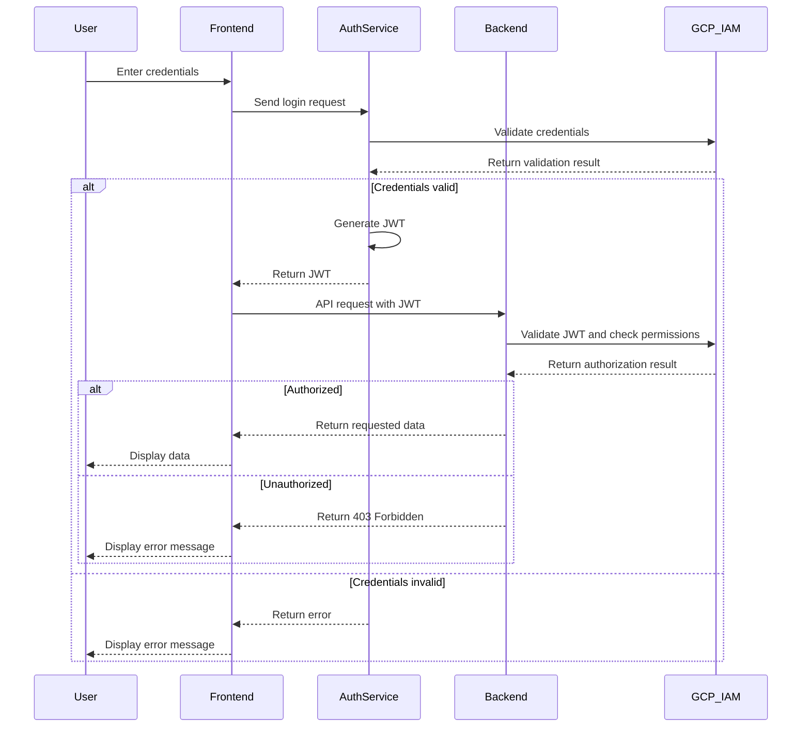
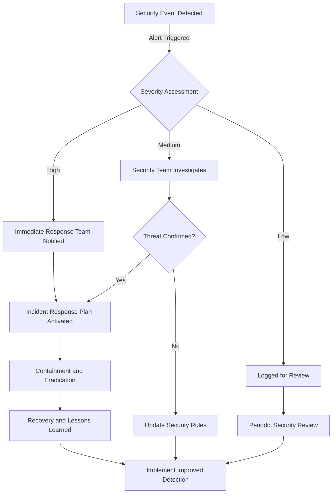

# INTRODUCTION

## SYSTEM OVERVIEW

The automated B2B lead generation and outreach solution is a comprehensive system designed to streamline and enhance the process of identifying potential business partners, gathering relevant information, and initiating personalized contact. This system leverages cutting-edge technologies to automate and optimize various stages of the lead generation and outreach process, significantly improving efficiency and effectiveness.

### High-Level Architecture



### Key Components

1. **Web Scraping Module**
   - Built with Python using libraries like BeautifulSoup and Scrapy
   - Extracts relevant information from company websites

2. **Data Processing Pipeline**
   - Python-based ETL processes
   - Cleans, structures, and enriches scraped data

3. **AI/ML Analysis**
   - Utilizes Google Cloud AI Platform
   - Generates company descriptions and insights

4. **CRM Integration**
   - Python backend with RESTful API
   - Integrates with client's existing CRM system

5. **Email Generation**
   - NLP-powered system using Google Cloud Natural Language API
   - Creates personalized outreach emails

6. **Outreach Software Integration**
   - Python-based API integration
   - Loads generated emails into client's outreach platform

7. **User Interface**
   - React-based frontend with Tailwind CSS
   - Provides dashboards, configuration interfaces, and reporting

8. **Reporting Module**
   - Generates insights and analytics using Google Data Studio
   - Integrates with the React frontend for data visualization

9. **Cloud Infrastructure**
   - Hosted on Google Cloud Platform
   - Utilizes services like Kubernetes Engine, Cloud Storage, and Cloud Functions

### Technology Stack

| Component | Technology |
|-----------|------------|
| Frontend | React, TypeScript, Tailwind CSS |
| Backend | Python, FastAPI |
| Database | Google Cloud Firestore |
| AI/ML | TensorFlow, Google Cloud AI Platform |
| Infrastructure | Google Kubernetes Engine, Cloud Storage, Cloud Functions |
| CI/CD | Google Cloud Build, GitLab CI |
| Monitoring | Google Cloud Monitoring, Prometheus |

### Key Features

1. Automated web scraping of company information
2. AI-driven company description generation
3. Intelligent CEO LinkedIn profile extraction
4. Seamless CRM integration and data enrichment
5. Personalized email generation using NLP
6. Integration with existing outreach software
7. Real-time performance monitoring and analytics
8. Scalable cloud-based infrastructure

### Data Flow



This system overview provides a high-level description of the entire automated B2B lead generation and outreach solution. It outlines the key components, technologies, features, and data flow within the system, demonstrating how various modules interact to create a comprehensive and efficient lead generation and outreach process.

## SYSTEM ARCHITECTURE

### PROGRAMMING LANGUAGES

The following programming languages have been selected for the development of the automated B2B lead generation and outreach solution:

| Language | Purpose | Justification |
|----------|---------|---------------|
| Python | Backend services, data processing, web scraping | - Extensive libraries for web scraping (BeautifulSoup, Scrapy)<br>- Strong support for data processing and NLP (pandas, NLTK)<br>- Easy integration with Google Cloud services<br>- Efficient for rapid development and prototyping |
| TypeScript | Frontend development | - Adds static typing to JavaScript, enhancing code quality and maintainability<br>- Excellent tooling and IDE support<br>- Seamless integration with React |
| SQL | Database queries | - Standard language for relational database operations<br>- Used for complex queries in Google Cloud SQL if needed |
| Go | Microservices (optional) | - High performance and concurrency support<br>- Efficient for building scalable microservices<br>- Good integration with Google Cloud Platform |

### HIGH-LEVEL ARCHITECTURE DIAGRAM

The following diagram provides an overview of the system's components and their interactions:


### COMPONENT DIAGRAMS

The following diagram details the specific components within the system and their relationships:

```mermaid
graph TD
    subgraph "Web Scraping Module"
    A1[Scraper Manager]
    A2[URL Extractor]
    A3[Content Parser]
    end

    subgraph "Data Processing Pipeline"
    B1[ETL Processor]
    B2[Data Cleaner]
    B3[Data Enrichment]
    end

    subgraph "AI/ML Analysis"
    C1[NLP Engine]
    C2[Company Classifier]
    C3[Insight Generator]
    end

    subgraph "CRM Integration"
    D1[API Connector]
    D2[Data Mapper]
    D3[Sync Manager]
    end

    subgraph "Email Generation"
    E1[Template Manager]
    E2[Content Personalizer]
    E3[Email Composer]
    end

    subgraph "Outreach Software Integration"
    F1[API Connector]
    F2[Campaign Manager]
    F3[Performance Tracker]
    end

    subgraph "User Interface"
    G1[React Components]
    G2[State Management]
    G3[API Client]
    end

    subgraph "Reporting Module"
    H1[Data Aggregator]
    H2[Visualization Engine]
    H3[Report Generator]
    end

    A1 --> A2 --> A3
    B1 --> B2 --> B3
    C1 --> C2 --> C3
    D1 --> D2 --> D3
    E1 --> E2 --> E3
    F1 --> F2 --> F3
    G1 --> G2 --> G3
    H1 --> H2 --> H3
```



### SEQUENCE DIAGRAMS

The following sequence diagram illustrates the lead generation and outreach process:



### DATA-FLOW DIAGRAM

The following diagram explains how information moves through the system:



This data flow diagram illustrates the movement of information from the initial input of company domains through various processing stages, ultimately resulting in personalized outreach and performance analytics. The user interface interacts with multiple components, allowing for configuration, management, and visualization of the entire process.

## SYSTEM DESIGN

### PROGRAMMING LANGUAGES

The following programming languages have been selected for the development of the automated B2B lead generation and outreach solution:

| Language | Purpose | Justification |
|----------|---------|---------------|
| Python | Backend services, data processing, web scraping | - Extensive libraries for web scraping (BeautifulSoup, Scrapy)<br>- Strong support for data processing and NLP (pandas, NLTK)<br>- Easy integration with Google Cloud services<br>- Efficient for rapid development and prototyping |
| TypeScript | Frontend development | - Adds static typing to JavaScript, enhancing code quality and maintainability<br>- Excellent tooling and IDE support<br>- Seamless integration with React |
| SQL | Database queries | - Standard language for relational database operations<br>- Used for complex queries in Google Cloud SQL if needed |
| Go | Microservices (optional) | - High performance and concurrency support<br>- Efficient for building scalable microservices<br>- Good integration with Google Cloud Platform |

### DATABASE DESIGN

The system will utilize Google Cloud Firestore, a NoSQL document database, for its primary data storage. This choice aligns with the scalability requirements and the semi-structured nature of the data we'll be handling.



### API DESIGN

The system will expose a RESTful API for communication between different components and integration with external systems. The API will be built using FastAPI, a modern, fast (high-performance) Python web framework for building APIs.

#### API Endpoints

```
/api/v1
├── /companies
│   ├── GET /
│   ├── POST /
│   ├── GET /{id}
│   ├── PUT /{id}
│   └── DELETE /{id}
├── /leads
│   ├── GET /
│   ├── POST /
│   ├── GET /{id}
│   ├── PUT /{id}
│   └── DELETE /{id}
├── /campaigns
│   ├── GET /
│   ├── POST /
│   ├── GET /{id}
│   ├── PUT /{id}
│   └── DELETE /{id}
├── /emails
│   ├── GET /
│   ├── POST /
│   ├── GET /{id}
│   └── PUT /{id}
└── /scrape
    └── POST /
```

#### Sample API Response

```json
{
  "id": "1234567890",
  "domain": "example.com",
  "name": "Example Company",
  "description": "A leading provider of innovative solutions.",
  "scrape_date": "2023-05-15T10:30:00Z",
  "metadata": {
    "industry": "Technology",
    "employee_count": "100-500"
  }
}
```

### USER INTERFACE DESIGN

The user interface will be developed using React with TypeScript and styled using Tailwind CSS. This combination provides a robust, type-safe frontend development experience with a utility-first CSS framework for rapid UI development.

#### Dashboard Layout



#### Key Components

1. **Header**: Contains logo, user profile, and global actions.
2. **Navigation**: Sidebar with links to main sections of the application.
3. **Dashboard Overview**: 
   - Key Metrics: Displays important KPIs using Tailwind CSS cards.
   - Recent Activity: Shows latest leads and campaign activities.
   - Quick Actions: Buttons for common tasks like starting a new campaign.
4. **Lead Management**: 
   - Lead list with filtering and sorting options.
   - Lead details view with editable fields.
5. **Campaign Management**:
   - Campaign creation wizard.
   - Campaign performance metrics and charts.
6. **Reports**: 
   - Customizable report builder.
   - Pre-defined report templates.

#### Sample React Component (TypeScript)

```typescript
import React from 'react';

interface LeadCardProps {
  id: string;
  companyName: string;
  ceoName: string;
  status: 'new' | 'contacted' | 'qualified' | 'converted';
}

const LeadCard: React.FC<LeadCardProps> = ({ id, companyName, ceoName, status }) => {
  return (
    <div className="bg-white shadow-md rounded-lg p-4 mb-4">
      <h3 className="text-lg font-semibold text-gray-800">{companyName}</h3>
      <p className="text-sm text-gray-600">CEO: {ceoName}</p>
      <span className={`inline-block px-2 py-1 text-xs font-semibold rounded-full ${
        status === 'new' ? 'bg-blue-100 text-blue-800' :
        status === 'contacted' ? 'bg-yellow-100 text-yellow-800' :
        status === 'qualified' ? 'bg-green-100 text-green-800' :
        'bg-purple-100 text-purple-800'
      }`}>
        {status.charAt(0).toUpperCase() + status.slice(1)}
      </span>
    </div>
  );
};

export default LeadCard;
```

This system design section outlines the key technical decisions and structures for the automated B2B lead generation and outreach solution. It maintains consistency with the previously mentioned technologies, emphasizing the use of Python for backend services, React with TypeScript and Tailwind CSS for the frontend, and Google Cloud Platform services for infrastructure and data storage.

## TECHNOLOGY STACK

### PROGRAMMING LANGUAGES

| Language | Purpose | Justification |
|----------|---------|---------------|
| TypeScript | Frontend development | - Adds static typing to JavaScript, enhancing code quality and maintainability<br>- Excellent tooling and IDE support<br>- Seamless integration with React |
| Python | Backend services, data processing, web scraping | - Extensive libraries for web scraping (BeautifulSoup, Scrapy)<br>- Strong support for data processing and NLP (pandas, NLTK)<br>- Easy integration with Google Cloud services<br>- Efficient for rapid development and prototyping |
| SQL | Database queries | - Standard language for relational database operations<br>- Used for complex queries in Google Cloud SQL if needed |
| Go | Microservices (optional) | - High performance and concurrency support<br>- Efficient for building scalable microservices<br>- Good integration with Google Cloud Platform |

### FRAMEWORKS AND LIBRARIES

#### Frontend
- React: JavaScript library for building user interfaces
- Tailwind CSS: Utility-first CSS framework for rapid UI development
- Redux: State management library for React applications
- React Router: Declarative routing for React applications
- Axios: Promise-based HTTP client for making API requests

#### Backend
- FastAPI: Modern, fast (high-performance) Python web framework for building APIs
- Celery: Distributed task queue for handling background jobs
- BeautifulSoup/Scrapy: Web scraping libraries
- NLTK/spaCy: Natural Language Processing libraries
- pandas: Data manipulation and analysis library
- NumPy: Numerical computing library
- scikit-learn: Machine learning library for data analysis and modeling

#### DevOps and Infrastructure
- Docker: Containerization platform
- Kubernetes: Container orchestration system
- Terraform: Infrastructure as Code tool for managing cloud resources

### DATABASES

| Database | Type | Purpose |
|----------|------|---------|
| Google Cloud Firestore | NoSQL document database | Primary data storage for structured data (Company, CEO, Lead, Email, Campaign information) |
| Google Cloud Storage | Object storage | Storage for large objects (scraped web pages, generated reports, email attachments) |
| Google Cloud SQL (PostgreSQL) | Relational database | Optional: For complex relational data and transactions if required |
| Redis | In-memory data structure store | Caching, session management, and task queue backend |

### THIRD-PARTY SERVICES

1. Google Cloud Platform Services
   - Google Kubernetes Engine (GKE): Container orchestration
   - Cloud Functions: Serverless compute
   - Cloud Pub/Sub: Messaging and event streaming
   - Cloud Natural Language API: NLP processing
   - Cloud Translation API: Multi-language support
   - Cloud Monitoring and Cloud Logging: Observability and logging

2. External APIs
   - LinkedIn API: Professional network data retrieval
   - Hunter.io API: Email verification and discovery
   - Clearbit API: Company and person data enrichment

3. Email Services
   - SendGrid: Transactional email service for system notifications

4. Analytics and Monitoring
   - Google Analytics: Web analytics for user interface
   - Prometheus: Monitoring and alerting toolkit
   - Grafana: Metrics visualization and dashboards

5. Security and Compliance
   - Google Cloud Identity and Access Management (IAM): Access control
   - Google Cloud Security Command Center: Security and risk management
   - Google Cloud Data Loss Prevention (DLP): Sensitive data detection and protection

6. Version Control and CI/CD
   - GitHub: Source code management
   - Google Cloud Build: Continuous Integration and Deployment

This technology stack leverages the power of TypeScript and React for the frontend, Python for backend services, and the Google Cloud ecosystem for infrastructure and services. It provides a robust, scalable, and maintainable foundation for the automated B2B lead generation and outreach solution, while staying consistent with the previously mentioned technologies and architectural choices.

## SECURITY CONSIDERATIONS

### AUTHENTICATION AND AUTHORIZATION

The system will implement a robust authentication and authorization mechanism to ensure secure access to the B2B lead generation and outreach solution.

#### Authentication

1. **Multi-Factor Authentication (MFA)**
   - Implement MFA using Google Cloud Identity Platform
   - Require a combination of:
     - Password (meeting complexity requirements)
     - Time-based One-Time Password (TOTP)
     - SMS or email verification codes

2. **Single Sign-On (SSO)**
   - Support SSO integration with popular identity providers (e.g., Google Workspace, Microsoft Azure AD)
   - Implement using OpenID Connect (OIDC) protocol

3. **JWT-based Session Management**
   - Use JSON Web Tokens (JWT) for maintaining user sessions
   - Implement short-lived access tokens (15 minutes) and longer-lived refresh tokens (7 days)
   - Store refresh tokens in HttpOnly, Secure cookies

#### Authorization

1. **Role-Based Access Control (RBAC)**
   - Implement fine-grained RBAC using Google Cloud Identity and Access Management (IAM)
   - Define the following roles:
     - Admin: Full system access
     - Manager: Access to all features except system configuration
     - User: Limited access to lead generation and campaign management
     - Read-only: View-only access to reports and dashboards

2. **Attribute-Based Access Control (ABAC)**
   - Implement ABAC for more granular control over resource access
   - Use attributes such as user department, project assignment, and data sensitivity level

3. **API Authorization**
   - Use OAuth 2.0 for API access authorization
   - Implement scopes to limit API access based on user roles

#### Authentication Flow



### DATA SECURITY

To protect sensitive information throughout the B2B lead generation and outreach process, the following data security measures will be implemented:

1. **Encryption at Rest**
   - Use Google Cloud Storage with default encryption for storing scraped data and generated reports
   - Implement application-level encryption for sensitive fields in Google Cloud Firestore using the Python cryptography library

2. **Encryption in Transit**
   - Enforce TLS 1.3 for all data transmissions
   - Implement HTTPS for all web traffic using Google-managed SSL certificates

3. **Data Masking and Anonymization**
   - Implement data masking for sensitive information in non-production environments
   - Use Google Cloud Data Loss Prevention (DLP) API to identify and redact sensitive data

4. **Access Controls**
   - Implement least privilege access using Google Cloud IAM
   - Use VPC Service Controls to create security perimeters around resources

5. **Data Retention and Deletion**
   - Implement automated data retention policies using Google Cloud Storage Object Lifecycle Management
   - Provide secure data deletion mechanisms in compliance with GDPR and CCPA requirements

6. **Audit Logging**
   - Enable Google Cloud Audit Logs for all data access and modifications
   - Implement application-level logging for user actions and data changes

#### Data Classification and Protection

| Data Type | Classification | Protection Measures |
|-----------|----------------|---------------------|
| User Credentials | Highly Sensitive | - Salted and hashed (using bcrypt)<br>- Stored in Google Cloud Secret Manager |
| Lead Contact Information | Sensitive | - Encrypted at rest<br>- Access restricted by RBAC<br>- Masked in non-production environments |
| Company Data | Confidential | - Encrypted at rest<br>- Access logged and audited |
| Generated Emails | Internal Use | - Encrypted at rest<br>- Access restricted by RBAC |
| System Logs | Internal Use | - Stored in Google Cloud Logging<br>- Retention policy applied |

### SECURITY PROTOCOLS

The following security protocols and standards will be implemented to maintain system security:

1. **Secure Development Lifecycle (SDL)**
   - Implement secure coding practices and conduct regular code reviews
   - Use static code analysis tools (e.g., Bandit for Python, ESLint for TypeScript/React)
   - Conduct regular security training for development team

2. **Vulnerability Management**
   - Perform regular vulnerability scans using Google Cloud Security Command Center
   - Implement a responsible disclosure program for external security researchers
   - Establish a patch management process for timely application of security updates

3. **Incident Response Plan**
   - Develop and maintain an incident response plan
   - Conduct regular tabletop exercises to test the plan
   - Integrate with Google Cloud's security incident management process

4. **Penetration Testing**
   - Conduct annual third-party penetration tests
   - Perform regular internal security assessments

5. **Compliance and Certifications**
   - Ensure compliance with GDPR, CCPA, and other relevant data protection regulations
   - Pursue SOC 2 Type II certification for the system

6. **Network Security**
   - Implement Web Application Firewall (WAF) using Google Cloud Armor
   - Use Virtual Private Cloud (VPC) for network isolation
   - Implement intrusion detection and prevention systems (IDS/IPS)

7. **Container Security**
   - Use Google Container Registry for secure storage of container images
   - Implement Google Binary Authorization to ensure only approved containers are deployed
   - Regularly scan container images for vulnerabilities using Google Container Analysis

8. **API Security**
   - Implement rate limiting and throttling to prevent API abuse
   - Use API keys and OAuth 2.0 for API authentication and authorization
   - Validate and sanitize all API inputs to prevent injection attacks

9. **Monitoring and Alerting**
   - Set up real-time security monitoring using Google Cloud Security Command Center
   - Implement automated alerting for suspicious activities or potential security breaches
   - Use Google Cloud Monitoring for performance and availability monitoring

#### Security Monitoring and Response Workflow



By implementing these security considerations, the B2B lead generation and outreach solution will maintain a strong security posture, protecting sensitive data and ensuring compliance with relevant regulations and industry standards. The use of Google Cloud Platform services provides a robust foundation for implementing these security measures, while the custom development in Python and React allows for tailored security controls specific to the application's needs.